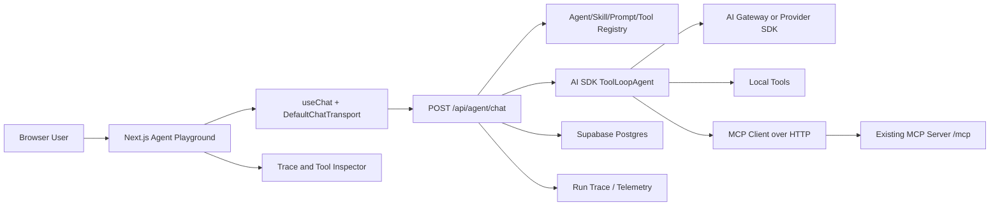

# 在线 Agent 体验台开发文档

最后更新：2026-06-09

## 1. 项目定位

目标是做一个在线 Agent 体验台，让用户可以在浏览器中体验、组合、调试和分享 `AI + Skill + Prompt + Tool`。它不是单纯的聊天窗口，而是一个面向开发者、产品团队和运营团队的 Agent 工作台。

核心能力：

- 在线选择 Agent、Skill、Prompt、Tool、模型和运行参数。
- 实时体验流式对话、工具调用、推理状态、引用来源和产物输出。
- 管理 Skill、Prompt 和 Tool 的版本，支持灰度、回滚和复用。
- 支持 MCP 工具接入，优先兼容当前仓库已有的 MCP Server 能力。
- 提供调试视图：请求参数、工具输入输出、步骤耗时、token 用量、错误原因。
- 支持会话保存、复现、分享和评测。

一句话版本：这是一个用于快速验证 Agent 能力的在线 playground，也是后续做成 Agent registry、prompt lab、tool marketplace 的基础。

## 2. 结论先行：技术选型建议

推荐方案：

- 前端框架：Next.js App Router，沿用当前仓库的 `apps/web`。
- UI 基础：shadcn/ui + Tailwind + `@workspace/ui`。
- AI 交互 UI：AI Elements。
- 聊天状态和流式协议：`@ai-sdk/react` 的 `useChat`。
- Server AI 编排：AI SDK v6 的 `ToolLoopAgent`、`createAgentUIStreamResponse`、`tool`、`streamText`。
- 模型接入：优先 AI Gateway 的 `provider/model` 字符串方式，必要时补充 provider SDK。
- MCP 接入：AI SDK MCP client，生产优先 HTTP Streamable transport。
- 数据层：Supabase Postgres，后续可加 Redis 做短期运行态和速率限制。
- 观测：AI SDK telemetry + 结构化 run/step/tool_call 日志。

为什么这套最合适：

- 当前仓库已经是 Next.js + React 19 + shadcn/Tailwind + MCP Server，AI Elements 和 AI SDK 的组合迁移成本最低。
- AI Elements 是 Vercel 官方 AI SDK 前端栈的一部分，组件直接落到代码库，适合深度定制 Tool、Reasoning、Source、Artifact 这些 Agent UI。
- `@ai-sdk/react` 负责消息状态、streaming 和 transport，它不是 UI 组件库。它和 AI Elements 是互补关系，不是二选一关系。
- AI SDK v6 已经提供 Agent、Tool Loop、MCP、UI message stream 等能力，正好覆盖 `skill + prompt + tool` 的核心链路。

不推荐一开始用更重的 CopilotKit 或 LangGraph UI 作为主栈。它们适合更强的应用内 Copilot、AG-UI 或多 Agent 工作流，但对这个仓库当前的 Next.js + MCP + 在线体验台来说，会过早引入额外运行时和协议层。

## 3. 当前市场和版本判断

截至 2026-06-09，通过官方文档和 npm registry 校验：

| 方案 | 当前定位 | npm 最新版本 | 近 30 天 npm 下载量 | 适合度 |
| --- | --- | ---: | ---: | --- |
| AI SDK `ai` | TypeScript AI 应用和 Agent 核心 SDK | `6.0.198` | 57,556,032 | 核心必选 |
| `@ai-sdk/react` | React 端 chat/completion/object hooks | `3.0.200` | 23,000,552 | 核心必选 |
| AI Elements | AI SDK 官方 React 组件 registry | `1.9.0` | 216,543 | 推荐 UI 层 |
| assistant-ui | 独立 React AI chat UI 和 runtime | `0.14.15` | 3,137,227 | 可作为备选 |
| CopilotKit | 应用内 Copilot 和 Agent 前端栈 | `1.59.5` | 1,090,300 | 复杂 Copilot 备选 |

下载量不是唯一指标。AI Elements 更年轻，下载量低于 assistant-ui，但它和 AI SDK 的 UI message、tool part、reasoning、streaming markdown 结合更直接。对本项目来说，集成风险比下载量更重要。

选型结论：

- 最适合本项目的是 `AI SDK + @ai-sdk/react + AI Elements`。
- 如果目标变成“几分钟搭出完整 ChatGPT 风格产品并用托管 thread persistence”，assistant-ui 更快。
- 如果目标变成“把 Agent 深度嵌进 SaaS 业务页面，自动读写页面状态，连接 LangGraph/AG-UI”，CopilotKit 更合适。
- 如果目标变成“复杂多 Agent 长任务编排、图式状态机、跨语言 agent runtime”，后端可引入 LangGraph/Mastra，但前端仍可保留 AI SDK UI message 协议。

## 4. 参考官方资料要点

- AI SDK 是用于 React、Next.js、Vue、Svelte、Node.js 等场景的 TypeScript AI 应用和 Agent toolkit，核心价值是标准化不同模型供应商的接入。
- `useChat` 用于构建 conversational UI，负责流式消息、状态更新和 transport。v5 之后 API 改为 transport 架构，不再按旧模式由 hook 内部管理 input state。
- AI Elements 是基于 shadcn/ui 的组件库和自定义 registry，强调可组合、AI SDK 集成、streaming 状态和类型安全。
- AI Elements 的 `Conversation` 负责消息容器和自动滚动，`Message` 负责消息、分支、actions、markdown 响应，`Tool` 负责工具调用详情展示。
- AI SDK Agents 使用 LLM、Tools 和 Loop 协作。`ToolLoopAgent` 适合多步工具调用。
- AI SDK MCP 支持连接 MCP server 的 tools、resources、prompts。生产推荐 HTTP transport，stdio 仅适合本地开发。

## 5. 产品信息架构

第一屏不要做营销 landing page，直接进入可用的 Agent 体验台。

推荐布局：

- 顶部栏：当前 Agent、模型、运行环境、分享、保存、设置。
- 左侧栏：Skill 列表、Prompt 版本、Tool set、示例任务。
- 中间区：AI Elements Conversation，展示用户消息、assistant 消息、reasoning、tool calls、sources、artifacts。
- 右侧检查器：当前 run trace、每一步 tool input/output、prompt assembled view、token/latency/cost、错误日志。
- 底部输入区：PromptInput，支持附件、变量补全、运行模式、提交/停止。

核心页面：

- `/agents`：Agent 体验台首页。
- `/agents/[agentId]`：指定 Agent playground。
- `/skills`：Skill registry。
- `/skills/[skillId]`：Skill 详情、版本、关联 prompt/tools。
- `/prompts`：Prompt lab。
- `/tools`：Tool registry。
- `/runs/[runId]`：运行记录、复现、分享。
- `/settings/models`：模型、provider、预算和 fallback 配置。

## 6. Agent、Skill、Prompt、Tool 的边界

### Agent

Agent 是运行时实例，负责把模型、指令、Skill、Prompt、Tool、上下文和停止条件组合起来。

推荐字段：

```ts
type AgentConfig = {
  id: string;
  name: string;
  description: string;
  defaultModel: string;
  defaultSkillId?: string;
  allowedSkillIds: string[];
  allowedToolIds: string[];
  maxSteps: number;
  visibility: "private" | "team" | "public";
};
```

### Skill

Skill 是可复用能力包，描述“这个 Agent 会什么、怎么做、可用哪些工具、怎样解释结果”。

推荐用 Markdown + frontmatter 或数据库版本化。前期可以存数据库，后期支持导入导出为文件。

```yaml
id: sec-filings-analyst
name: SEC Filings Analyst
version: 1.0.0
description: Analyze company filings and summarize risk factors.
requiredTools:
  - get_company_filings
  - get_company_info
optionalTools:
  - get_company_news
inputSchema:
  query: string
  filingType: string
safety:
  approvalRequiredTools: []
```

Skill body 示例：

```md
You are a filings analyst.

Use filings before news when answering regulatory questions.
Always cite filing date and filing type.
If data is missing, say what was unavailable instead of guessing.
```

### Prompt

Prompt 是可测试、可版本化的指令模板。Skill 可以引用多个 Prompt，例如 system prompt、task prompt、tool routing prompt、output prompt。

Prompt 必须支持：

- 变量 schema。
- 版本号。
- 变更说明。
- 示例输入输出。
- 评测用例。
- 所属 Skill 或 Agent。

### Tool

Tool 是可执行能力，可能来自本地函数、HTTP API、MCP server 或外部平台。

推荐字段：

```ts
type ToolDefinition = {
  id: string;
  name: string;
  description: string;
  source: "local" | "mcp" | "http";
  inputSchema: unknown;
  permission: "read" | "write" | "dangerous";
  requiresApproval: boolean;
  renderer?: "json" | "table" | "chart" | "artifact";
};
```

当前仓库已有 MCP tools，例如 `get_company_info`、`get_company_news`、`get_company_filings` 等，可以作为第一批在线 Agent 工具。

## 7. 推荐系统架构



服务端关键路径：

1. 客户端通过 `useChat` 发送 UI messages 和当前运行配置。
2. `/api/agent/chat` 验证用户权限、Agent 配置、Skill 版本和 Tool policy。
3. 系统组装 instructions：base instruction + skill instruction + prompt variables + safety policy。
4. 系统加载可用 tools：本地 tools + MCP tools。
5. 使用 `ToolLoopAgent` 执行多步推理和工具调用。
6. 使用 `createAgentUIStreamResponse` 返回 UI message stream。
7. 后台记录 run、steps、tool calls、usage 和错误。

## 8. 前端实现方案

### 核心组件

第一阶段只安装必要 AI Elements 组件：

```bash
pnpm dlx ai-elements@latest add conversation
pnpm dlx ai-elements@latest add message
pnpm dlx ai-elements@latest add prompt-input
pnpm dlx ai-elements@latest add tool
pnpm dlx ai-elements@latest add reasoning
pnpm dlx ai-elements@latest add sources
pnpm dlx ai-elements@latest add model-selector
```

不要一次性安装全部组件，避免引入暂时不用的依赖和类型冲突。

### Chat 状态

使用 `@ai-sdk/react`：

```tsx
"use client";

import { useChat } from "@ai-sdk/react";
import { DefaultChatTransport } from "ai";

export function AgentChat({ agentId }: { agentId: string }) {
  const chat = useChat({
    transport: new DefaultChatTransport({
      api: "/api/agent/chat",
    }),
  });

  return null;
}
```

实现时需要在 transport/request 层追加 `agentId`、`skillId`、`promptVersionId`、`model`、`toolPolicy` 等运行配置。不要按旧版 AI SDK 写法依赖 `ai/react` 或旧的 `useChat` input state 模式。

### 消息渲染

推荐渲染策略：

- 文本：`MessageResponse`，保证 streaming markdown、代码块、表格、数学公式正常。
- 工具调用：`Tool`，显示 pending/running/completed/error/approval 状态。
- 推理：`Reasoning`，只显示模型允许展示的 reasoning summary，不展示隐藏链路。
- 引用：`Sources`。
- 产物：Artifact/code/table/chart 组件。

### 右侧 Trace Inspector

Trace Inspector 不直接读模型流，而是读服务端记录的 run state：

- run id。
- selected agent/skill/prompt/model。
- assembled instruction 摘要。
- step timeline。
- tool input/output。
- token usage。
- error/retry/fallback。
- raw JSON，仅 admin 可见。

## 9. 后端 API 设计

建议 API：

| Method | Path | 用途 |
| --- | --- | --- |
| `GET` | `/api/agents` | Agent 列表 |
| `GET` | `/api/agents/:id` | Agent 配置 |
| `POST` | `/api/agent/chat` | Agent 流式对话 |
| `GET` | `/api/skills` | Skill 列表 |
| `POST` | `/api/skills` | 创建 Skill |
| `POST` | `/api/skills/:id/versions` | 发布 Skill 版本 |
| `GET` | `/api/prompts` | Prompt 列表 |
| `POST` | `/api/prompts/:id/versions` | 发布 Prompt 版本 |
| `GET` | `/api/tools` | Tool registry |
| `POST` | `/api/tools/:id/test` | 单独测试 Tool |
| `POST` | `/api/tool-approvals/:id` | 批准或拒绝工具调用 |
| `GET` | `/api/runs/:id` | 查看运行记录 |
| `POST` | `/api/runs/:id/replay` | 复现运行 |

`POST /api/agent/chat` 请求体建议：

```ts
type AgentChatRequest = {
  messages: unknown[];
  agentId: string;
  skillId?: string;
  promptVersionId?: string;
  model?: string;
  temperature?: number;
  maxSteps?: number;
  toolPolicy?: {
    enabledToolIds: string[];
    requireApproval: boolean;
  };
  variables?: Record<string, unknown>;
};
```

服务端伪代码：

```ts
import { ToolLoopAgent, createAgentUIStreamResponse, stepCountIs } from "ai";

export async function POST(request: Request) {
  const body = await request.json();
  const runtime = await buildAgentRuntime(body);

  const agent = new ToolLoopAgent({
    model: runtime.model,
    instructions: runtime.instructions,
    tools: runtime.tools,
    stopWhen: stepCountIs(runtime.maxSteps),
  });

  return createAgentUIStreamResponse({
    agent,
    uiMessages: body.messages,
    sendSources: true,
    onStepFinish: runtime.onStepFinish,
  });
}
```

## 10. 数据模型建议

第一阶段用 Supabase Postgres 即可。

核心表：

- `agents`：Agent 基本配置。
- `skills`：Skill 基本信息。
- `skill_versions`：Skill 版本内容、状态、发布时间。
- `prompts`：Prompt 基本信息。
- `prompt_versions`：Prompt 模板、变量 schema、测试样例。
- `tools`：Tool registry。
- `agent_tools`：Agent 可用工具映射。
- `sessions`：用户会话。
- `messages`：UI messages，可按 session 存。
- `runs`：一次 Agent 调用。
- `run_steps`：每一步模型/工具调用。
- `tool_calls`：工具调用输入输出、状态、approval。
- `artifacts`：生成的表格、代码、图表、文件。
- `eval_cases`：Prompt/Skill 评测用例。
- `eval_runs`：评测结果。

重要索引：

- `runs(user_id, created_at desc)`。
- `runs(agent_id, created_at desc)`。
- `run_steps(run_id, step_index)`。
- `tool_calls(run_id, created_at)`。
- `skill_versions(skill_id, version)`。
- `prompt_versions(prompt_id, version)`。

## 11. Tool 和 MCP 接入方案

本地工具：

- 使用 AI SDK `tool()` 定义。
- `inputSchema` 用 Zod。
- 执行函数必须记录 latency、input hash、output summary。
- 默认只开放 read 工具。

MCP 工具：

- 使用 AI SDK MCP client。
- 生产环境优先 HTTP transport。
- stdio 仅用于本地开发。
- 对远程 MCP server 设置 allowlist、headers、OAuth 或 token。
- 禁止跟随不可信 redirect，降低 SSRF 风险。

工具权限策略：

| 权限 | 示例 | 默认策略 |
| --- | --- | --- |
| `read` | 搜索、读取财报、查询价格 | 可自动执行 |
| `write` | 创建记录、发消息、更新配置 | 需要用户确认 |
| `dangerous` | 删除、转账、发外部邮件 | 默认禁用 |

Tool UI 必须展示：

- 工具名。
- 状态。
- 参数摘要。
- 执行耗时。
- 结果摘要。
- 错误原因。
- 是否由用户批准。

## 12. Prompt 和 Skill 版本管理

版本策略：

- Skill 和 Prompt 都不可原地覆盖生产版本。
- 每次编辑生成 draft。
- 发布时生成 immutable version。
- Agent 引用明确版本，避免线上行为漂移。
- 支持 `latest` alias，但生产 Agent 默认 pin 到具体版本。

Prompt 变量：

```ts
type PromptVariable = {
  key: string;
  label: string;
  type: "string" | "number" | "boolean" | "enum" | "json";
  required: boolean;
  defaultValue?: unknown;
};
```

Prompt 组装顺序：

1. Platform safety instruction。
2. Agent base instruction。
3. Skill instruction。
4. Prompt template with variables。
5. Tool policy。
6. Output format。
7. Conversation memory summary。

## 13. 模型和 Provider 策略

推荐默认走 AI Gateway：

```ts
import { generateText } from "ai";

await generateText({
  model: "anthropic/claude-sonnet-4.5",
  prompt: "Hello",
});
```

原因：

- 少装 provider 包。
- 统一 provider/model 格式。
- 方便切换模型。
- 有 gateway routing、fallback、usage tracking。

需要直接 provider SDK 的场景：

- embeddings，因为 AI Gateway 不覆盖所有 embedding 需求。
- provider-specific 参数或能力。
- 私有部署、专有 endpoint、fine-tuned model。

模型选择策略：

- 默认给用户 3 档：快速、均衡、强推理。
- 每个 Agent 可限制可选模型。
- 记录每次 run 的 model id、provider、版本和 fallback。
- 不在代码里写死过时模型，发布前通过 Gateway 可用模型接口刷新列表。

## 14. 安全和治理

必须实现：

- 用户认证和基础 RBAC。
- Rate limit。
- Tool allowlist。
- Tool approval。
- Secret redaction。
- Prompt injection 防护。
- 运行超时和 step 上限。
- 输出内容安全过滤。
- Run logs 权限隔离。
- 远程 MCP URL allowlist。
- 上传文件大小、类型和扫描限制。

Tool 安全规则：

- Browser 端永远不接触 provider key、MCP token、数据库 service key。
- Tool 输入输出都要做结构化日志，但敏感字段 redaction。
- 写工具默认不在 public demo 中开放。
- 用户可见的是工具摘要，admin 才能查看 raw payload。

## 15. 观测、评测和调试

运行观测：

- run duration。
- time to first token。
- total tokens。
- tool count。
- tool latency。
- retries。
- model fallback。
- error class。
- estimated cost。

Prompt/Skill 评测：

- 每个 Skill 至少 5 个 golden cases。
- 每个 Tool 至少 1 个 schema validation case 和 1 个 failure case。
- 支持 replay run。
- 支持对比两个 prompt version 的输出差异。
- 支持人工评分：正确性、完整性、可执行性、格式。

调试面板：

- Assembled prompt view。
- Tool routing decision。
- Step timeline。
- UIMessage raw view。
- ModelMessage raw view，仅 admin。
- Error stack，仅 admin。

## 16. 实施阶段计划

### Phase 0：准备和依赖校准

- 确认新增功能落在 `apps/web`。
- 安装 `ai`、`@ai-sdk/react`、必要 provider 或 AI Gateway 配置。
- 安装必要 AI Elements 组件。
- 增加 `.env.example` 中 AI Gateway、Supabase、Redis 说明。

验收：

- `pnpm lint` 通过。
- `pnpm type-check` 通过。
- 一个空白 Agent 页面能打开。

### Phase 1：最小 Agent Playground

- `/agents` 页面。
- `useChat` + `Conversation` + `MessageResponse` + `PromptInput`。
- `/api/agent/chat` route。
- 一个内置 demo Agent。
- 一个本地 read-only tool。
- 流式响应和工具调用显示。

验收：

- 用户能输入问题并看到流式回答。
- 工具调用能显示 pending/running/completed/error。
- 页面移动端和桌面端不重叠。

### Phase 2：Skill、Prompt、Tool Registry

- Skill 列表和详情。
- Prompt 版本管理。
- Tool registry。
- Agent 与 Skill/Tool 的映射。
- Prompt variables 表单。

验收：

- 用户能切换 Skill。
- 用户能选择 Prompt 版本。
- 工具可按 Agent 限制。

### Phase 3：接入当前 MCP Server 能力

- 将现有 SP500 MCP tools 接到 Agent Playground。
- 支持 `/mcp` Streamable HTTP。
- 读取 tool schemas。
- 工具结果用专门 UI 渲染，例如财务数据表格、新闻列表、filing 摘要。

验收：

- `get_company_info`、`get_company_news`、`get_company_filings` 至少三个工具能被 Agent 调用。
- Tool Inspector 可查看输入输出摘要。

### Phase 4：运行记录、复现和分享

- 保存 sessions、messages、runs、steps、tool_calls。
- `/runs/[runId]` 页面。
- replay 功能。
- share link。

验收：

- 同一 run 可以完整回放。
- 分享链接不会泄露敏感 raw payload。

### Phase 5：评测和治理

- Prompt eval cases。
- Skill eval suite。
- Tool failure tests。
- Admin 审核和发布流程。
- 速率限制和 budget。

验收：

- 发布 Prompt/Skill 前可跑评测。
- public demo 有预算和频率保护。

## 17. 与当前仓库的落点

建议落点：

- `apps/web/app/agents/page.tsx`：Agent 体验台首页。
- `apps/web/app/agents/[agentId]/page.tsx`：具体 Agent。
- `apps/web/app/api/agent/chat/route.ts`：AI SDK stream endpoint。
- `apps/web/lib/agents/*`：Agent runtime、registry、prompt assembly。
- `apps/web/lib/tools/*`：本地 tool definitions。
- `apps/web/lib/mcp/*`：MCP client adapter。
- `apps/web/components/agents/*`：Agent 页面组件。
- `apps/web/components/ai-elements/*`：AI Elements registry 组件。

不要把在线体验台直接放进 `apps/web-app`。`apps/web-app` 是当前 MCP App 的 single-file HTML build，适合嵌入式 MCP App resource，不适合作为完整管理台。后续如果要把体验台的某个结果页嵌入 MCP App，再单独做 web-app 页面。

## 18. 主要风险

| 风险 | 影响 | 缓解 |
| --- | --- | --- |
| AI SDK v6 API 变化 | 编译或运行不兼容 | 锁定版本，写 adapter，改动前查官方 docs |
| AI Elements 较新 | 组件类型或依赖冲突 | 只安装必要组件，组件代码进仓库后可修 |
| Tool 权限失控 | 安全事故 | allowlist、approval、RBAC、审计日志 |
| Prompt injection | 工具误用或数据泄露 | tool policy、上下文隔离、输出约束 |
| MCP server 不稳定 | Agent 失败 | 超时、重试、fallback、错误 UI |
| 成本不可控 | 账单风险 | rate limit、budget、模型分层 |
| Trace 泄露敏感数据 | 安全风险 | redaction、admin-only raw payload |

## 19. 立即可执行的下一步

1. 在 `apps/web` 安装 `ai`、`@ai-sdk/react` 和必要 AI Elements 组件。
2. 新建 `/agents` 页面，完成三栏 playground 布局。
3. 新建 `/api/agent/chat`，先实现无工具的 streaming chat。
4. 加入一个本地 `echo_debug` 或 `get_current_time` read-only tool。
5. 将现有 MCP 的 `get_company_info` 接入为第一个真实工具。
6. 增加 run trace 的最小数据结构。
7. 跑 `pnpm lint`、`pnpm type-check`，再用浏览器验证桌面和移动端。

## 20. 资料来源

- [AI SDK official docs](https://ai-sdk.dev/docs)
- [AI SDK useChat reference](https://ai-sdk.dev/docs/reference/ai-sdk-ui/use-chat)
- [AI SDK transport docs](https://ai-sdk.dev/docs/ai-sdk-ui/transport)
- [AI SDK agents overview](https://ai-sdk.dev/docs/agents/overview)
- [AI SDK ToolLoopAgent reference](https://ai-sdk.dev/docs/reference/ai-sdk-core/tool-loop-agent)
- [AI SDK MCP tools docs](https://ai-sdk.dev/docs/ai-sdk-core/mcp-tools)
- [AI SDK createAgentUIStreamResponse reference](https://ai-sdk.dev/docs/reference/ai-sdk-core/create-agent-ui-stream-response)
- [AI Gateway provider docs](https://ai-sdk.dev/providers/ai-sdk-providers/ai-gateway)
- [AI Elements docs](https://elements.ai-sdk.dev)
- [AI Elements Conversation](https://elements.ai-sdk.dev/components/conversation)
- [AI Elements Message](https://elements.ai-sdk.dev/components/message)
- [AI Elements Tool](https://elements.ai-sdk.dev/components/tool)
- [assistant-ui docs](https://www.assistant-ui.com/docs)
- [assistant-ui architecture](https://www.assistant-ui.com/docs/architecture)
- [CopilotKit docs](https://docs.copilotkit.ai/)
- [npm: ai](https://www.npmjs.com/package/ai)
- [npm: @ai-sdk/react](https://www.npmjs.com/package/@ai-sdk/react)
- [npm: ai-elements](https://www.npmjs.com/package/ai-elements)
- [npm: @assistant-ui/react](https://www.npmjs.com/package/@assistant-ui/react)
- [npm: @copilotkit/react-core](https://www.npmjs.com/package/@copilotkit/react-core)
